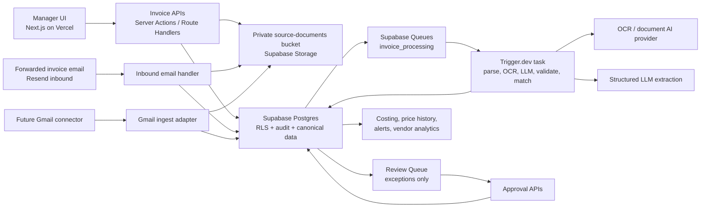
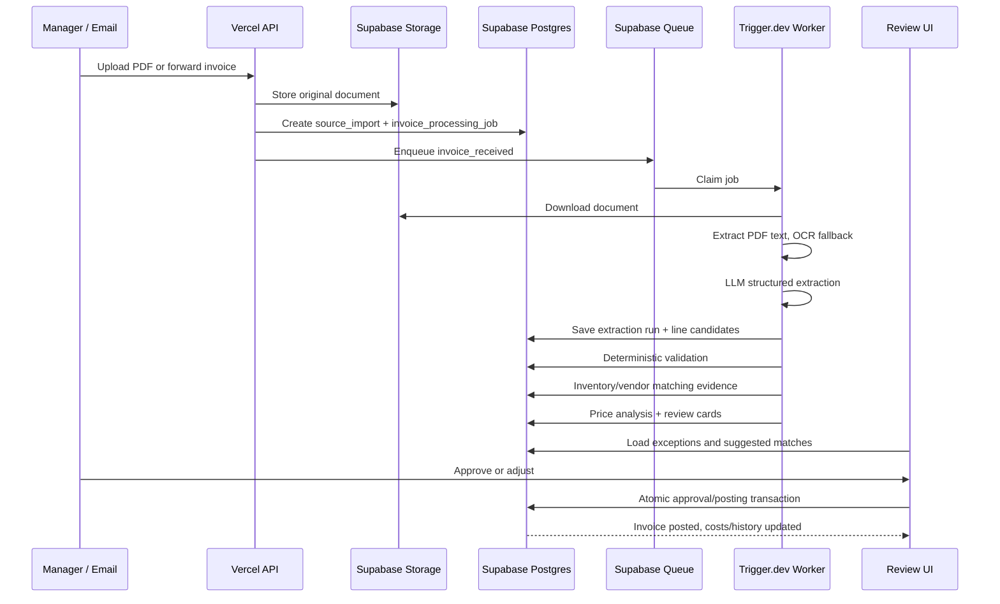
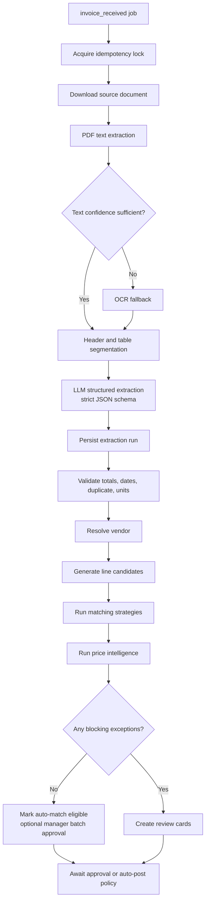

# Clopen Invoice Intelligence Engine — Architecture and Technical Design

**Date:** June 30, 2026

**Status:** Draft for review

**Product:** Clopen / Static OS restaurant operations platform

**Scope:** Architecture, database design, worker orchestration, API contracts, UI flows, implementation roadmap, risk review, and extension points. This document intentionally does not include implementation code.

## 1. Executive Architecture Overview

The Invoice Intelligence Engine should become the automated ingestion layer for purchasing, receiving, inventory costing, vendor pricing, and future ordering intelligence. It extends the existing Static OS foundation: Next.js 16 App Router, TypeScript, Supabase Postgres/Auth/Storage, tenant-scoped RLS, `source_imports`, private source documents, purchasing/receiving/invoice tables, and the review-first extraction pattern already designed for recipes.

The core design principle is: AI proposes, deterministic services validate, humans review exceptions, canonical tables are updated only through auditable approval flows.

For MVP, the recommended production architecture is Vercel for the frontend and manager APIs, Supabase Postgres/Auth/Storage as the system of record, Supabase Queues for durable job handoff, and Supabase Edge Functions only for short orchestration steps. Heavy PDF/OCR/LLM extraction should run in Trigger.dev v4 tasks because invoice processing is long-running, retry-prone, and benefits from built-in queues, concurrency controls, run history, and replay. Supabase Edge Functions currently have wall-clock and resource limits, while Trigger.dev is purpose-built for long-running TypeScript workflows with retries and observability.

Canonical data remains in Postgres. Workers write extraction attempts, line candidates, match evidence, price alerts, and review cards into staging tables. Approval writes to `invoices`, `invoice_lines`, `vendor_items`, `item_aliases`, `item_cost_history`, and inventory ledger/costing tables in one idempotent transaction.

## 2. System Diagram

## 3. Event Flow Diagram

## 4. Domain Boundaries

The system should be split into seven bounded components:

1. **Ingestion adapters:** PDF upload, email forwarding, future Gmail connector. They normalize every source into `source_imports`, private storage, and `invoice_processing_jobs`.
2. **Document extraction:** PDF text extraction first, OCR fallback when text confidence is poor, page-level provenance retained.
3. **Structured invoice extraction:** LLM returns typed vendor, header, totals, adjustments, line items, page references, and uncertainty reasons.
4. **Deterministic validation:** totals, tax/freight/discount reconciliation, duplicate detection, date sanity, currency, quantity/unit checks, pack-size parsing.
5. **Matching engine:** vendor item code, prior match, alias, exact name, fuzzy similarity, embedding/semantic candidate ranking, confidence bands.
6. **Price intelligence:** last cost, average cost, moving weighted cost impact, pack-size changes, vendor changes, trend and alert generation.
7. **Review and posting:** exception cards, approvals, audit log, idempotent canonical writes.

## 5. Database Schema

The current app already has `invoices`, `invoice_lines`, `vendors`, `vendor_items`, inventory items, aliases, source imports, and purchasing/receiving tables. The following design keeps those canonical tables and adds intelligence-specific staging, review, idempotency, and history.

### Canonical Tables

**`vendors`**

- Purpose: canonical supplier identity.
- Key fields: `id`, `organization_id`, `name`, `normalized_name`, `default_terms`, `email_domains`, `phone`, `account_number`, `status`, `created_at`, `updated_at`.
- Indexes: `(organization_id, normalized_name) unique where status <> 'archived'`, GIN/trigram on `name`.
- RLS: organization members can read; managers can mutate.

**`inventory_items`**

- Purpose: canonical stocked/purchased item.
- Key fields: existing item identity plus `count_unit_id`, `recipe_unit_id`, `category_id`, `storage_location_id`, `shelf_life_days`, `suggested_par_level`, `cogs_category_id`, `preferred_vendor_id`, `current_cost_per_base_unit`, `costing_method`.
- Indexes: `(organization_id, location_id, status)`, `(organization_id, normalized_name)`, `(preferred_vendor_id)`.
- RLS: tenant and location scoped.

**`vendor_items`**

- Purpose: vendor-specific purchasable SKU linked to inventory.
- Key fields: `id`, `organization_id`, `vendor_id`, `inventory_item_id`, `vendor_item_code`, `vendor_description`, `normalized_description`, `purchase_unit_id`, `pack_size_text`, `case_quantity`, `base_quantity_per_purchase_unit`, `last_case_price`, `last_unit_cost`, `is_preferred`, `created_from_invoice_line_id`.
- Indexes: `(vendor_id, vendor_item_code) unique where vendor_item_code <> ''`, `(inventory_item_id, vendor_id)`, trigram on `normalized_description`.
- RLS: organization scoped.

**`item_aliases`**

- Purpose: alternate names and vendor descriptions that improve future matching.
- Key fields: `id`, `organization_id`, `inventory_item_id`, `vendor_id`, `alias_text`, `normalized_alias`, `source`, `confidence`, `created_from_review_action_id`.
- Indexes: `(organization_id, normalized_alias)`, `(inventory_item_id)`.

**`invoices`**

- Purpose: approved or in-review invoice header.
- Existing fields should be extended with `source_channel`, `external_message_id`, `document_hash`, `duplicate_of_invoice_id`, `validation_status`, `processing_job_id`, `currency`, `subtotal_amount`, `status`.
- Idempotency: unique partial indexes on `(organization_id, vendor_id, invoice_number)` and `(organization_id, document_hash)`.

**`invoice_line_items` / existing `invoice_lines`**

- Purpose: invoice line canonical/staged bridge.
- Existing fields should be extended with `raw_line_text`, `purchase_unit_text`, `purchase_unit_id`, `pack_size_structured`, `case_quantity`, `base_quantity`, `unit_cost_per_base_unit`, `match_confidence`, `match_strategy`, `review_status`.
- Indexes: `(invoice_id, line_index) unique`, `(inventory_item_id)`, `(vendor_product_code)`, `(review_status)`.

**`item_cost_history`**

- Purpose: immutable vendor and inventory cost facts.
- Key fields: `id`, `organization_id`, `location_id`, `inventory_item_id`, `vendor_id`, `vendor_item_id`, `invoice_id`, `invoice_line_id`, `effective_date`, `case_price`, `base_unit_cost`, `purchase_unit_id`, `base_quantity`, `pack_size_text`, `cost_source`, `previous_base_unit_cost`, `cost_change_pct`.
- Indexes: `(inventory_item_id, effective_date desc)`, `(vendor_item_id, effective_date desc)`, `(organization_id, location_id, effective_date desc)`.
- Audit: append-only; corrections create reversal/replacement rows.

### Intelligence Staging Tables

**`invoice_processing_jobs`**

- Purpose: durable state machine per processing attempt.
- Fields: `id`, `organization_id`, `location_id`, `source_import_id`, `invoice_id`, `idempotency_key`, `source_channel`, `status`, `attempt_count`, `priority`, `locked_by`, `locked_at`, `queued_at`, `started_at`, `completed_at`, `failed_at`, `error_code`, `error_message`, `worker_provider`, `worker_run_id`, `parser_version`, `schema_version`.
- Status: `queued`, `extracting`, `validating`, `matching`, `needs_review`, `auto_approved`, `approved`, `posted`, `failed`, `cancelled`, `superseded`.
- Indexes: `(status, priority, queued_at)`, `(organization_id, location_id, status)`, unique `(idempotency_key)`.

**`invoice_extraction_runs`**

- Purpose: immutable record of each parser/LLM run.
- Fields: `id`, `job_id`, `source_import_id`, `parser_version`, `ocr_provider`, `llm_model`, `schema_version`, `raw_text_path`, `structured_payload`, `payload_hash`, `confidence`, `issues`, `started_at`, `completed_at`.
- Indexes: `(job_id, created_at desc)`, `(payload_hash)`.

**`invoice_line_candidates`**

- Purpose: extracted line items before approval.
- Fields: `id`, `extraction_run_id`, `invoice_id`, `line_index`, `raw_text`, `vendor_item_code`, `description`, `quantity`, `unit_price`, `line_total`, `purchase_unit_text`, `pack_size_text`, `page_number`, `bbox`, `extraction_confidence`, `validation_status`, `current_best_match_id`.
- Indexes: `(invoice_id, line_index) unique`, `(validation_status)`.

**`invoice_line_match_suggestions`**

- Purpose: ranked matching evidence, separate from selected match.
- Fields: `id`, `line_candidate_id`, `inventory_item_id`, `vendor_item_id`, `strategy`, `score`, `rank`, `reason_codes`, `unit_compatibility`, `price_compatibility`, `created_at`.
- Strategies: `vendor_item_code`, `previous_invoice_match`, `inventory_alias`, `exact_name`, `fuzzy_similarity`, `semantic_match`, `reviewer_history`.
- Indexes: `(line_candidate_id, rank)`, `(inventory_item_id)`.

**`review_queue`**

- Purpose: exception-oriented human workflow.
- Fields: `id`, `organization_id`, `location_id`, `entity_type`, `entity_id`, `review_type`, `severity`, `status`, `title`, `summary`, `prefill_payload`, `blocking_reasons`, `assigned_to`, `due_at`, `resolved_by`, `resolved_at`, `created_at`.
- Types: `suggested_match`, `new_item`, `price_alert`, `duplicate_invoice`, `pack_size_change`, `vendor_changed`, `unit_conversion_changed`, `receipt_mismatch`.
- Indexes: `(organization_id, location_id, status, severity, created_at)`, `(entity_type, entity_id)`.

**`review_actions`**

- Purpose: immutable audit trail of human/AI decisions.
- Fields: `id`, `review_queue_id`, `actor_type`, `actor_id`, `action`, `before_payload`, `after_payload`, `notes`, `created_at`.
- Actions: `approved`, `edited`, `rejected`, `merged`, `created_inventory_item`, `linked_alias`, `dismissed_alert`.

**`price_alerts`**

- Purpose: structured alerts generated from invoice analysis.
- Fields: `id`, `organization_id`, `location_id`, `inventory_item_id`, `vendor_id`, `invoice_line_id`, `alert_type`, `severity`, `previous_value`, `current_value`, `change_pct`, `status`, `review_queue_id`, `created_at`, `resolved_at`.
- Indexes: `(organization_id, location_id, status, severity)`, `(inventory_item_id, created_at desc)`.

### Audit, RLS, and Duplicate Controls

- Every tenant-scoped table includes `organization_id`; location-specific operating rows include `location_id`.
- Enable RLS on all tables in exposed schemas. Use `TO authenticated` plus organization/location membership predicates; do not authorize from user-editable metadata.
- Manager policies allow approval, posting, and catalog edits. Staff policies allow upload/receive/count actions for assigned locations but not cost approval.
- Store original documents in private Supabase Storage paths: `org/{organization_id}/location/{location_id}/invoices/{source_import_id}/{filename}`.
- Deduplicate by SHA-256 document hash, email `Message-ID`, vendor + invoice number, and optional normalized invoice totals/date.
- All approval/posting functions accept an idempotency key and return the existing result when replayed.
- Corrections create review actions and replacement cost-history rows; posted invoice lines are never silently overwritten.

## 6. Matching Logic

The matching engine should produce a ranked list, not a single opaque decision.

Confidence bands:

- `0.95–1.00`: auto-match eligible if totals, units, pack size, and vendor identity also validate.
- `0.75–0.94`: suggested match review card.
- `<0.75`: new item workflow unless a manager explicitly links it.

Scoring order:

1. **Vendor item code:** exact vendor SKU match, strongest signal.
2. **Previous invoice match:** same vendor description/code previously approved.
3. **Inventory alias:** alias table match scoped by organization/vendor.
4. **Exact normalized name:** canonical item name after stop-word/unit cleanup.
5. **Fuzzy similarity:** trigram/Levenshtein score against names and aliases.
6. **LLM semantic match:** embedding or LLM-ranked semantic candidate, used only after deterministic candidates are collected.

Each suggestion stores reason codes such as `same_vendor_code`, `same_pack_size`, `unit_compatible`, `price_within_10_pct`, `alias_from_review`, or `semantic_only`. A semantic-only result should never auto-post.

## 7. Worker Sequence

Retry strategy:

- Step-level retries for provider calls with exponential backoff and jitter.
- Whole-job retries are idempotent because extraction runs are immutable and canonical posting is gated by idempotency keys.
- Poison jobs move to `failed` after the configured max attempts and create a review card with source document access.
- Provider errors are classified as `transient_provider`, `schema_validation`, `unsupported_document`, `auth`, `storage`, or `unknown`.

Concurrency:

- MVP: one queue per environment, concurrency 2-5 jobs/location to limit LLM spend and vendor API bursts.
- Growth: partition by organization/location and priority; reserve capacity for interactive uploads.
- Enterprise: tenant-level concurrency budgets, per-provider circuit breakers, dedicated worker pools.

## 8. Deployment Architecture and Technology Choices

### Frontend: Vercel

Vercel remains the right frontend host because the app is already Next.js, managers need fast authenticated UI, and Server Actions/route handlers are a good fit for upload registration, status reads, and review mutations. Current Vercel Functions with Fluid Compute can support longer functions, but invoice parsing should still be outside request/response paths because OCR and LLM work is variable and retry-heavy.

### Backend: Supabase

Supabase Postgres is the system of record. It provides relational constraints, RLS, auth integration, storage, queues, cron, and transactional posting. Supabase Queues are a good fit for durable handoff from ingestion to workers, with the caveat that the Queues product is still marked public alpha in current Supabase materials, so production readiness should be reassessed before high-volume enterprise use.

### Worker Infrastructure Recommendation

| Option | Strengths | Weaknesses | Recommendation |
| --- | --- | --- | --- |
| Supabase Edge Functions | Close to data, simple deploy, good for webhooks and short orchestration | Resource/time limits; poor fit for OCR-heavy and multi-step AI jobs | Use for ingestion/webhooks and lightweight queue triggers |
| Trigger.dev v4 | TypeScript-native, long-running tasks, retries, queues, concurrency, observability, replay | Additional vendor and runtime | MVP and growth recommendation |
| Docker Worker | Portable, full control, easy provider SDKs | Requires hosting, deploys, autoscaling, monitoring | Good growth fallback if Trigger.dev limits/cost become painful |
| ECS/Fargate | Strong isolation, enterprise controls, autoscaling | Operationally heavier, AWS expertise | Enterprise recommendation |
| EC2 | Maximum control and low steady-state cost | Highest operational burden | Avoid unless workloads become predictable and large |
| Fly.io | Simple regional Docker deploys | More ops than Trigger.dev, less native workflow UI | Good for a custom worker in growth stage |
| Railway | Fast setup | Less enterprise control | Prototype-only fallback |

Recommended path:

- **MVP:** Vercel + Supabase + Trigger.dev + Supabase Storage.
- **Growth:** Keep Vercel/Supabase; add Dockerized worker option on Fly.io or Trigger.dev self-host if cost/control requires it; introduce provider abstraction for OCR/LLM.
- **Enterprise:** Vercel Enterprise or dedicated frontend, Supabase dedicated/self-hosted Postgres as needed, ECS/Fargate workers, private networking, tenant-level queues, formal SIEM/log retention.

### Storage: Supabase Storage vs Cloudflare R2

Use Supabase Storage for MVP because it integrates directly with Supabase Auth/RLS patterns, keeps documents close to source imports, and reduces operational surface. Add Cloudflare R2 when storage volume, egress cost, or archival retention becomes material. If R2 is introduced, Postgres still owns metadata and signed-access policy.

### Monitoring: Better Stack and Sentry

Use Sentry for Next.js and worker exceptions with release tracking and trace IDs. Use Better Stack for uptime checks, log drains, alert routing, and incident timelines. Store durable business process state in `invoice_processing_jobs`; observability tools should augment, not replace, the database state machine.

### Email: Resend, Gmail Future

Use Resend inbound email for MVP forwarding because it is simpler than Gmail OAuth and produces controlled webhooks. Future Gmail integration should be an ingestion adapter that writes the same `source_imports` and `invoice_processing_jobs` records.

## 9. API Specification

Prefer Next.js Server Actions for app-internal mutations and REST route handlers for upload/email/webhook boundaries. All APIs require authenticated manager/staff context except inbound email webhooks, which require signature verification.

### Invoice Upload

`POST /api/invoices/upload`

- Auth: manager or staff with location access.
- Request: multipart file, `locationId`, optional `vendorId`, optional `sourceChannel`.
- Response: `{ invoiceId, sourceImportId, jobId, status: "queued" }`.
- Behavior: hash file, store private object, dedupe, create job, enqueue.

### Invoice Status

`GET /api/invoices/{invoiceId}/status`

- Response: job status, progress step, extraction confidence, review counts, blocking errors.

### Invoice Review

`GET /api/invoices/{invoiceId}/review`

- Response: header, source preview URL, line candidates, match suggestions, validation issues, review cards.

### Approve Review

`POST /api/invoices/{invoiceId}/reviews/{reviewId}/approve`

- Request: selected match or edited prefill payload, `idempotencyKey`.
- Response: updated review card and affected line status.

### Reject Review

`POST /api/invoices/{invoiceId}/reviews/{reviewId}/reject`

- Request: reason, optional replacement action.
- Response: card status.

### Merge Existing Inventory

`POST /api/inventory/merge`

- Request: source item, target item, alias handling, `idempotencyKey`.
- Response: merge review action and target item summary.
- Constraint: manager only; blocked if posted history cannot be safely re-pointed without explicit audit reversal.

### Create Inventory Item

`POST /api/invoices/{invoiceId}/lines/{lineId}/create-inventory-item`

- Request: prefilled identity, purchasing, inventory, recipe, accounting fields.
- Response: inventory item, vendor item, alias, line match.

### Cost History

`GET /api/inventory/{inventoryItemId}/cost-history?vendorId=&from=&to=`

- Response: item cost time series, moving average, vendor breakdown, alert markers.

### Vendor History

`GET /api/vendors/{vendorId}/items/{vendorItemId}/history`

- Response: invoices, price changes, pack changes, preferred-vendor status.

## 10. UI / UX Wireframe Descriptions

### Invoice Inbox

Dense table optimized for scanning: status, vendor, invoice number, date, total, lines, exceptions, uploaded/received time, owner. Primary actions: upload, open review, retry failed, batch approve clean invoices. Filters: needs review, failed, price alerts, vendor, date.

### Invoice Detail

Two-pane layout. Left: PDF/document preview with page navigation and highlighted line anchors. Right: invoice header, validation summary, line table, totals reconciliation, processing timeline. Exception rows expand inline instead of opening separate pages.

### Review Queue

One card per decision, grouped by invoice and severity. Cards show proposed answer first, not a blank form. Actions should be approve, edit, link existing item, create item, reject, snooze. Keyboard-friendly batch approval for high-confidence suggested matches.

### Price Alerts

List grouped by vendor/item with chips for `>15% increase`, pack-size change, vendor change, conversion change, duplicate suspected. Each alert shows previous cost, new cost, change percent, source invoice, and quick actions: accept expected, correct pack size, switch preferred vendor, open item history.

### Inventory Match Review

Line-focused view: vendor description and invoice context at top, ranked match candidates below with confidence, reason codes, pack/unit compatibility, last purchase date, and last price. The default selected action is the highest safe suggestion.

### New Item Wizard

Single-page progressive form with AI-prefilled sections: identity, purchasing, inventory, recipe, accounting. Show missing or risky fields only. Approve creates `inventory_items`, `vendor_items`, and `item_aliases` in one transaction.

### Vendor Price History

Trend chart plus invoice table. Show last cost, average cost, preferred vendor, pack-size history, and outlier annotations. From here, managers can mark a vendor item preferred or open related invoice lines.

Click minimization:

- Clean invoices appear as batch-approve rows.
- Suggested matches can be approved directly from the review card.
- New-item workflow starts with all extracted fields filled.
- Review completion returns the manager to the next unresolved card.

## 11. Implementation Phases

### Phase 0: Design Review and Slice Definition

- Review this design with product/engineering.
- Decide whether Trigger.dev is acceptable for MVP.
- Decide auto-approval policy: recommended default is no auto-posting until enough restaurant-specific history exists; allow batch approval of clean invoices.

### Phase 1: Data Foundation

- Extend invoice/job/review/cost-history schema.
- Add idempotency keys, duplicate indexes, audit tables, RLS policies, and storage path policies.
- Add pgTAP coverage for RLS, duplicate detection, and approval/posting idempotency.

### Phase 2: Ingestion MVP

- Build upload flow and forwarded-email adapter.
- Store originals, hash documents, create jobs, enqueue workers.
- Show invoice inbox and job status.

### Phase 3: Extraction Worker

- Replace current regex-only invoice Edge Function with provider-neutral extraction pipeline.
- Implement PDF text extraction, OCR fallback, strict LLM schema, validation persistence, and retry classification.

### Phase 4: Matching and Review

- Implement deterministic matching strategies and suggestion scoring.
- Build review queue, match review, and new-item wizard.
- Persist review actions and aliases.

### Phase 5: Posting and Price Intelligence

- Implement approval transaction, vendor item updates, cost history, current cost updates, alerts, and receipt/invoice reconciliation.
- Add vendor price history and cost history APIs.

### Phase 6: Hardening and Scale

- Add concurrency controls, dashboards, alerting, replay tooling, provider circuit breakers, and cost controls.
- Add Gmail connector and richer OCR provider routing.

## 12. Technical Risks

- **Extraction accuracy:** invoices vary widely. Mitigation: source anchors, confidence, deterministic validation, review-first posting.
- **Unit and pack ambiguity:** pack sizes are restaurant-specific and vendor-specific. Mitigation: structured pack parser plus human-confirmed vendor item mappings.
- **Silent cost corruption:** bad matches can damage COGS. Mitigation: confidence bands, no semantic-only auto-posting, approval audit, reversible cost history.
- **Worker timeouts:** OCR/LLM processing can exceed serverless limits. Mitigation: Trigger.dev or Docker workers, step retries, durable jobs.
- **Duplicate invoices:** uploads and forwarded emails can repeat. Mitigation: document hash, email ID, vendor/invoice unique constraints, duplicate review cards.
- **RLS gaps:** new tables can expose tenant data if policies are loose. Mitigation: RLS on every exposed table, membership predicates, database tests, Supabase advisors.
- **Cost overruns:** OCR/LLM can become expensive. Mitigation: text-first parsing, OCR only when needed, per-location concurrency, provider usage logging.

## 13. Estimated Development Effort

- Phase 1 data foundation: 4-6 engineering days.
- Phase 2 upload/email ingestion: 3-5 days.
- Phase 3 extraction worker: 7-12 days depending on OCR/LLM provider choice.
- Phase 4 matching and review UI: 8-12 days.
- Phase 5 posting and price intelligence: 6-10 days.
- Phase 6 hardening: 5-10 days.

Total MVP estimate: 5-8 focused engineering weeks for a robust first release. A thin prototype that only uploads, extracts, and queues manual review could be 2-3 weeks, but it would not deliver the promised reduction in manual inventory work.

## 14. Recommended Testing Strategy

- **Database tests:** pgTAP for RLS, uniqueness, posting idempotency, cost-history immutability, approval permissions, and duplicate detection.
- **Pure unit tests:** pack-size parsing, line-total validation, confidence scoring, price-alert thresholds, fuzzy matching normalization.
- **Worker tests:** fixture PDFs/text payloads, schema-validation failures, retry behavior, provider error classification, idempotent replays.
- **Integration tests:** upload to storage, job creation, queue enqueue, worker writes staging records, approval transaction updates canonical tables.
- **UI tests:** review queue interaction, new-item wizard, suggested match approval, price-alert dismissal, invoice detail states.
- **Golden fixtures:** maintain known invoices from PLCB, produce, dry goods, beer, and broadline vendors with expected structured output.
- **Observability tests:** ensure each job emits trace IDs, status transitions, error codes, and Sentry/Better Stack breadcrumbs.

## 15. Scalability Considerations

- Use queue partitioning by organization/location for fairness.
- Keep worker payloads small; store raw text and structured payloads in DB/storage and pass IDs through queues.
- Use trigram indexes for fuzzy matching and pgvector only when semantic search becomes necessary at scale.
- Cache vendor/item candidates per invoice job to reduce repeated DB queries.
- Introduce tenant budgets for LLM/OCR calls.
- Archive raw extraction artifacts according to retention policy, while keeping canonical invoice/cost history indefinitely.
- Move from Supabase Storage to R2 only when storage/egress economics justify the extra integration.
- For enterprise, isolate large tenants with dedicated queues and worker pools.

## 16. Security Review

- Store all invoice documents in private buckets with short-lived signed URLs.
- Verify inbound email webhooks with provider signatures and reject attachments outside accepted MIME/types.
- Run malware scanning on uploaded/emailed attachments before worker processing when moving beyond MVP.
- Do not expose service-role keys in Vercel client code; all privileged mutations run server-side or in workers.
- Use RLS membership checks based on trusted membership tables, not user-editable metadata.
- Redact document text from logs; log IDs, hashes, and error codes instead.
- Encrypt provider credentials in environment secret stores.
- Ensure LLM/OCR providers are approved for invoice data and configure no-training/data-retention options where available.
- Add audit trails for all match, create item, merge, approve, reject, and post actions.
- Run Supabase security/performance advisors after schema changes.

## 17. Future Enhancements and Extension Points

- **Recipe costing:** current costs already flow into inventory items and recipe unit costs.
- **Menu engineering:** cost history plus Toast PMIX enables gross-margin and popularity analysis.
- **Purchase order generation:** vendor item prices and pars can drive suggested orders.
- **Inventory variance:** invoice costs connect actual purchases to theoretical usage and counts.
- **Waste tracking:** waste entries can use current item costs from the same cost-history layer.
- **Vendor comparison:** price history by vendor item enables preferred vendor recommendations.
- **Automated ordering:** order guides can use preferred vendor, par, lead time, and recent cost volatility.
- **Margin forecasting:** future menu sales forecasts can combine recipe costs, vendor trends, and sales mix.
- **AI purchasing recommendations:** weekly worker can summarize price changes, low pars, and substitute opportunities.
- **Weekly purchasing summaries:** generated from invoices, alerts, POs, receipts, and vendor history without new core tables.

## 18. Open Review Decisions

1. Should MVP use Trigger.dev managed cloud, or should Clopen keep workers entirely inside Supabase/Vercel until volume proves the need?
2. Should clean `95%+` invoices auto-post, or should MVP require manager batch approval even when no exceptions exist?
3. Which OCR/LLM providers are acceptable for vendor invoice data under Clopen's privacy requirements?
4. Should the first release support email forwarding, or should it launch with PDF upload only and add forwarding in Phase 2?

